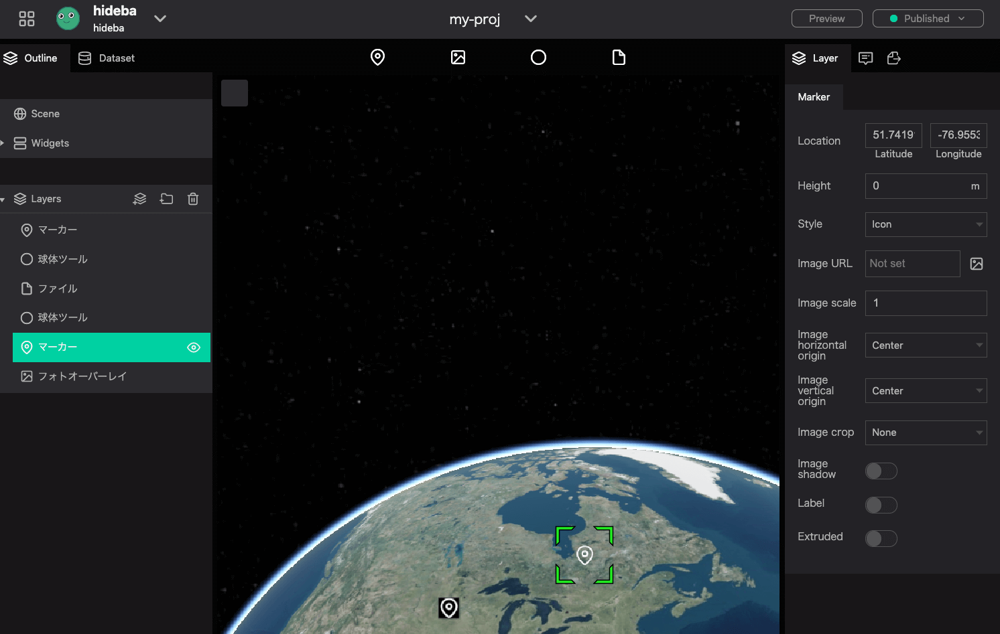

<!-- PROJECT LOGO -->
 

<!-- TODO: change this link later -->
  

  

    Re:Earth is a state-of-the-art WebGIS platform with expandability through plug-ins and has the ease of running in the browser.
     
    <a  href="https://docs.reearth.io/"><strong>Documents >></strong></a>
    &emsp;&emsp;&emsp;&emsp;
    <a href="https://docs.reearth.io/oss"><strong>OSS Webpage >></strong></a>
     
    <!-- TODO: here -->
    <a href="">View Demo</a>
    ·
    <a href="https://github.com/reearth/reearth/issues">Report Bug</a>
    ·
    <a href="https://github.com/reearth/reearth/discussions">Request Feature</a>
  

Re:Earth consist of 2 repositories. Don't forget to check out our [front-end](https://github.com/reearth/reearth-web) and [back-end](https://github.com/reearth/reearth-backend) repositories 👍

<!-- ABOUT THE PROJECT -->
## Features
🔌 Highly extensible thanks to the robust plugin system

💻 Super handy being browser-based

💪 Supports standard GIS data formats (CSV, KML, CZML, GeoJSON and shapefile)

📢 Easily make a project public

✨ Freely style the map

## Built With
* [React](https://github.com/facebook/react)
* [TypeScript](https://github.com/microsoft/TypeScript)
* [Go](https://github.com/golang/go)
* [GraphQL](https://github.com/graphql)
* [MongoDB](https://www.mongodb.com/)
* [WebAssembly](https://webassembly.org/) + [QuickJS](https://github.com/bellard/quickjs)

### Necessities

**Front-end**
* Node.js: Latest LTS version

**Back-end**
* Golang +1.16
* Docker

<!-- USAGE EXAMPLES -->
## Usage

_For examples and more, please refer to the [Documentation](https://docs.reearth.io)_

<!-- ROADMAP -->
## Roadmap

See the [Roadmap](https://github.com/reearth/reearth/projects/1) for a list of proposed features (and known issues).
If your have any requests for features, they are more than welcome! Just create an issue [here](https://github.com/reearth/reearth/issues?q=is%3Aissue+is%3Aopen+sort%3Aupdated-desc) with the `feature request` tag.

<!-- CONTRIBUTING -->
## Contributing
### Contributing Guide
<!-- TODO: add link later -->
Read our [contributing guide]() to learn about our development process, how to propose bugfixes and improvements, and how to build and test your changes in React.
### Code of Conduct
Re:Earth has adopted a Code of Conduct that we expect project participants to adhere to. Please read [the full](./CODE_OF_CONDUCT.md) text so that you can understand what actions will and will not be tolerated.

### Good First Issues
To help you get your feet wet and get you familiar with our contribution process, we have a list of good first issues that contain bugs which have a relatively limited scope. This is a great place to get started.

<!-- LICENSE -->
## License

Distributed under the MIT License. See `LICENSE` for more information.

<!-- CONTACT -->
## Contact

Re:Earth team - info@reearth.dev

<!-- TODO: replace here -->
Project Link: [https://github.com/reearth/reearth](https://github.com/reearth/reearth)
