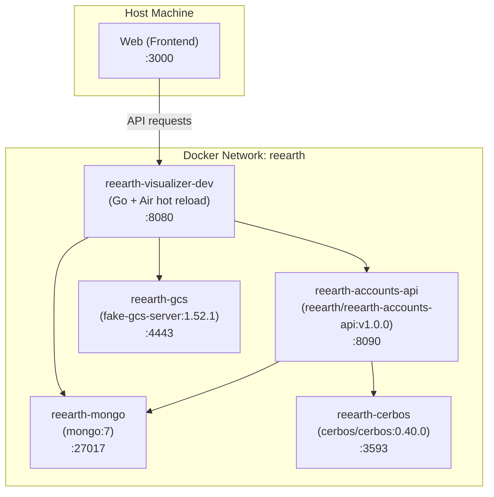
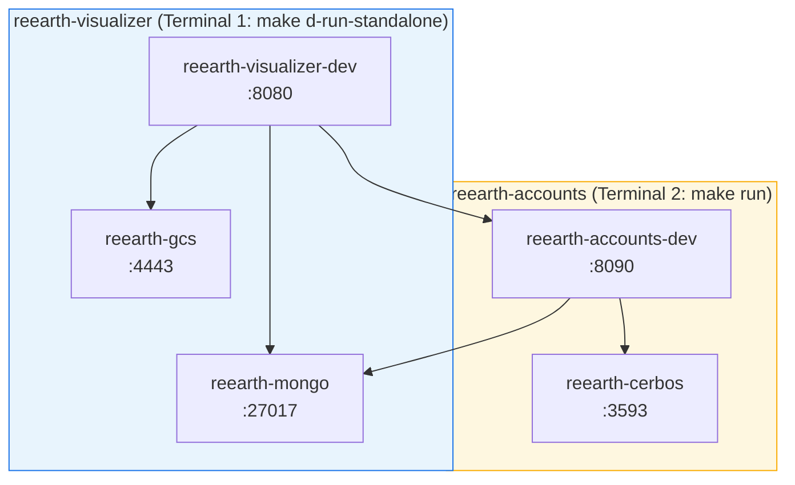

[](https://github.com/reearth/reearth-visualizer/actions/workflows/ci_server.yml) [](https://codecov.io/gh/reearth/reearth)

# reearth/server

A back-end API server application for Re:Earth

## Architecture

The development environment runs the following containers via Docker Compose:



| Container | Image | Port | Description |
| --- | --- | --- | --- |
| reearth-visualizer-dev | (local build) | 8080 | Visualizer API server with hot reload |
| reearth-accounts-api | reearth/reearth-accounts-api:v1.0.0 | 8090 | User/workspace management API |
| reearth-cerbos | cerbos/cerbos:0.40.0 | 3593 | Authorization policy engine |
| reearth-mongo | mongo:7 | 27017 | MongoDB (shared by visualizer and accounts) |
| reearth-gcs | fsouza/fake-gcs-server:1.52.1 | 4443 | Fake GCS for local asset storage |

## Development

### Starting Services

#### Method 1: Using Docker Hub image (default)

Start all backend services with a single command:

```bash
make d-run
```

This brings up all required containers with their dependencies: **visualizer** + **accounts API** + **Cerbos** + **MongoDB** + **GCS**

This method uses the public image `reearth/reearth-accounts-api:v1.0.0` from Docker Hub.

To stop all services:

```bash
make d-down
```

To check the accounts API logs:

```bash
make d-logs-accounts
```

---

#### Method 2: Local accounts development

If you are developing `reearth-accounts` locally, you can run it from source instead of the Docker Hub image.

**Terminal 1** — Start visualizer without accounts (visualizer + mongo + gcs only):

```bash
make d-run-standalone
```

**Terminal 2** — Clone and start accounts API from source:

```bash
git clone https://github.com/reearth/reearth-accounts.git
cd reearth-accounts/server
cp .env.docker.example .env.docker
make run
```

This starts `reearth-accounts-dev` and `reearth-cerbos` and attaches them to the `reearth` Docker network.



### Initializing the Environment

After the services are running, initialize GCS and create the demo user:

```bash
make gcs-bucket
make mockuser-accounts
```

Or simply:

```bash
make init
```

### Database and Environment Reset

Reset the development environment including database and GCS:

```bash
make d-reset-data
```

This command will:

- Stop MongoDB and GCS services
- Remove all data directories
- Restart services
- Initialize GCS bucket
- Create mock user

### Complete Environment Cleanup

Remove all Docker resources and data (use with caution):

```bash
make d-destroy
```

This command will:

- Stop all Docker containers
- Remove all Docker images, volumes, and networks
- Delete all data directories
- **WARNING:** This is a destructive operation and cannot be undone

> **Note:** This command will prompt for confirmation before proceeding.

### Code Quality and Testing in Docker

Run linting and tests inside the Docker container (same environment as CI/CD):

```bash
# Run linter with auto-fix
make d-lint

# Run tests
make d-test
```

> **Note:**
>
> - These commands require the development container to be running (`make d-run`)
> - Some e2e tests may fail in Docker due to MongoDB permission constraints
> - For local e2e testing, use `make test` instead

### Quick Reference

| Command | Description |
| --- | --- |
| `make d-run` | Start all services including accounts API from Docker Hub |
| `make d-run-standalone` | Start visualizer without accounts API (mongo + gcs only) |
| `make d-down` | Stop all services |
| `make d-logs-accounts` | Follow accounts API logs |
| `make init` | Initialize GCS bucket and create mock user |
| `make d-reset-data` | Reset database and GCS, reinitialize with mock data |
| `make d-destroy` | Remove ALL Docker resources and data (destructive) |
| `make d-lint` | Run golangci-lint in Docker container |
| `make d-test` | Run tests in Docker container |

## Authentication

Authentication is handled by the shared service [Re:Earth Accounts](https://github.com/reearth/reearth-accounts).
When using `make d-run`, a pre-built `reearth/reearth-accounts-api` container from Docker Hub is started automatically.

There are two authentication modes: **Mock User** (default) and **Identity Provider (IdP)**.

### 1. Mock User Mode (Default)

Uses a demo user for local development without requiring an external IdP.
No additional configuration is needed — these are the defaults.

**web/.env**

```bash
REEARTH_WEB_AUTH_PROVIDER=mock
```

**server/.env.accounts.docker**

```bash
REEARTH_MOCK_AUTH=true
```

> If you are using [Method 2](#method-2-local-accounts-development), edit `reearth-accounts/server/.env.docker` instead.

### 2. Identity Provider (IdP) Mode

To use an IdP (e.g. Auth0), edit `server/.env.accounts.docker` with your Auth0 credentials:

```bash
REEARTH_MOCK_AUTH=false
REEARTH_AUTH0_DOMAIN=https://your-tenant.auth0.com/
REEARTH_AUTH0_AUDIENCE=https://api.your-domain.com
REEARTH_AUTH0_CLIENTID=your-auth0-client-id
REEARTH_AUTH0_CLIENTSECRET=your-auth0-client-secret
REEARTH_AUTH0_WEBCLIENTID=your-auth0-web-client-id
```

> If you are using [Method 2](#method-2-local-accounts-development), edit `reearth-accounts/server/.env.docker` instead.

Also update **web/.env**:

```bash
REEARTH_WEB_AUTH_PROVIDER=auth0
```

After starting the server, you need to register the IdP user by providing the `sub` claim:

```bash
curl -H 'Content-Type: application/json' http://localhost:8080/api/signup -d @- << EOF
{
  "sub": "auth0|xxxxxxxx1234567890xxxxxx",
  "email": "user@example.com",
  "username": "example user",
  "secret": "@Hoge123@Hoge123"
}
EOF
```

## Project Export and Import

Re:Earth provides functionality to export and import complete projects including all associated data.

### Export

Projects can be exported via the GraphQL API using the `ExportProject` mutation.

#### Export Process Flow

1. **Create temporary zip file** - A zip archive is created with project ID as filename
2. **Export project data** - Project metadata and settings
3. **Export scene data** - Scene configuration and visualization settings
4. **Export plugins** - All plugins used in the project
5. **Export assets** - Images, 3D models, and other assets
6. **Add metadata** - Export information including:
   - `host`: Current host URL
   - `project`: Project ID
   - `timestamp`: Export timestamp (RFC3339 format)
   - `exportDataVersion`: Data format version (current: `"1"`)
7. **Upload to storage** - The completed zip file is uploaded to configured storage
8. **Return path** - Returns download path: `/export/{projectId}.zip`

#### Exported Zip Structure

```
project.zip
├── project.json                        # Complete project data with metadata
├── assets/                             # Project assets
│   ├── {asset-filename-1}
│   └── {asset-filename-2}
└── plugins/                            # Plugin files
    └── {plugin-id}/
        ├── {extension-id-1}.js
        └── {extension-id-2}.js
```

#### Export Data Version

The `exportDataVersion` field enables compatibility management for future format changes:

- Current version: `"1"`
- Version is embedded in `exportedInfo` section of `project.json`
- Future versions can support schema migrations and new features

**File**: `internal/adapter/gql/resolver_mutation_project.go:219`

### Import

Projects can be imported via two methods:

#### 1. Split Upload API (`POST /api/split-import`)

Handles chunked file uploads for large project files.

**Process Flow**:

1. **Chunk Upload** - Client uploads file in chunks (16MB each)
2. **Session Management** - Server tracks upload progress per file ID
3. **Temporary Project Creation** - On first chunk, creates placeholder project with status `UPLOADING`
4. **Chunk Assembly** - When all chunks received, assembles complete file
5. **Async Processing** - Spawns goroutine to process import
6. **Import Execution** - Calls `ImportProject()` with assembled data

**File**: `internal/app/file_split_uploader.go:69`

#### 2. Storage Trigger API (`POST /api/import-project`)

Triggered automatically when a project zip file is uploaded directly to storage (e.g., GCS/S3 bucket notification).

**Authentication**:

- No auth token required (triggered by storage service)
- User context extracted from filename: `{workspaceId}-{projectId}-{userId}.zip`
- Operator context automatically generated from user ID

**File**: `internal/app/file_import_common.go:95`

### ImportProject() Implementation

Core import logic that processes the extracted project data.

**Processing Order**:

1. **Project Data** - `ImportProjectData()` - Project metadata and configuration
2. **Assets** - `ImportAssetFiles()` - Upload and register asset files
3. **Scene Creation** - Create new scene for imported project
4. **ID Replacement** - Replace old scene ID with new scene ID throughout data
5. **Plugins** - `ImportPlugins()` - Install required plugins and schemas
6. **Scene Data** - `ImportSceneData()` - Scene configuration and layers
7. **Styles** - `ImportStyles()` - Layer styling information
8. **NLS Layers** - `ImportNLSLayers()` - New layer system data
9. **Story** - `ImportStory()` - Storytelling configuration
10. **Status Update** - Mark import as `SUCCESS` or `FAILED`

**Version Handling**:

The `version` parameter (from `exportDataVersion`) enables format-specific processing:

```go
func ImportProject(
    ctx context.Context,
    usecases *interfaces.Container,
    op *usecase.Operator,
    wsId accountdomain.WorkspaceID,
    pid id.ProjectID,
    importData *[]byte,
    assetsZip map[string]*zip.File,
    pluginsZip map[string]*zip.File,
    result map[string]any,
    version *string,  // Export data version for compatibility
) bool
```

**Current Implementation**:

- Version `"1"` is the current format
- Version parameter is extracted but not yet used for branching
- Future versions can implement migration logic based on version value

**Future Usage Example**:

```go
if version != nil && *version == "2" {
    // Handle version 2 format with new features
    return importV2(...)
}
// Default to version 1 processing
return importV1(...)
```

**File**: `internal/app/file_import_common.go:250`

### Error Handling

All import steps update project status on failure:

- Status: `ProjectImportStatusFailed`
- Error message logged to `importResultLog`
- Processing stops at first error

### Import Status Values

- `ProjectImportStatusNone` - Not imported
- `ProjectImportStatusUploading` - Upload in progress
- `ProjectImportStatusProcessing` - Import processing
- `ProjectImportStatusSuccess` - Import completed successfully
- `ProjectImportStatusFailed` - Import failed (check `importResultLog`)

### Configuration

**File Size Limit**: 500MB (enforced in `pkg/file/zip.go:114`)

**Chunk Size**: 16MB (split upload)

**Cleanup**: Stale upload sessions (>24 hours) are automatically cleaned up
