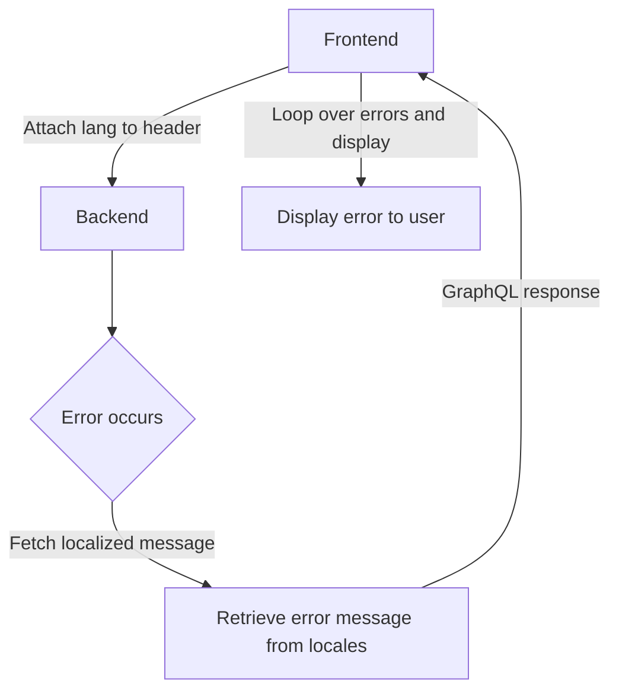

# 🌐 Error Message Localization Guide

This document explains how error messages are defined, edited, and displayed in the system with localization support.

---

## 📁 Directory Structure

```text
server/
├── internal/app/i18n/
│   ├── locales/errmsg/         # JSON error message definitions (internal use)
│   └── message/errmsg/         # Auto-generated Go code (internal use)
├── pkg/i18n/
│   ├── locales/errmsg/         # JSON error message definitions (shared)
│   ├── gen/errmsg/             # Code generation scripts
│   └── message/errmsg/         # Auto-generated Go code
```

---

## 🛠 Error Message Format

### Example JSON Definition

```json
{
  "pkg": {
    "project": {
      "invalid_alias": {
        "message": "Invalid alias name",
        "description": "The alias must be 5-32 characters long and can only contain alphanumeric characters, underscores, and hyphens."
      }
    }
  }
}
```

- `message`: Short error message
- `description`: Additional explanation (optional)

---

## ✍️ How to Add or Edit Error Messages

1. Edit the following files:

    - `server/internal/app/i18n/locales/errmsg/ja.json`
    - `server/internal/app/i18n/locales/errmsg/en.json`
    - `server/pkg/i18n/locales/errmsg/ja.json`
    - `server/pkg/i18n/locales/errmsg/en.json`

2. Run the generator to update constants and message mappings:

    ```bash
    make generate
    ```

    > 📝 This regenerates:  
    > `server/pkg/i18n/message/errmsg/errmsg_generated.go`

---

## ⚙️ Backend Usage Example

```go
import "server/internal/locales"

var ErrInvalidAlias = verror.NewVError(
  errmsg.ErrKeyPkgProjectInvalidAlias,
  errmsg.ErrorMessages[errmsg.ErrKeyPkgProjectInvalidAlias],
  message.MultiLocaleTemplateData(map[string]interface{}{
    "minLength": 5,
    "maxLength": 32,
    "allowedChars": func(locale language.Tag) string {
      return entitymsg.GetLocalizedEntityMessage(entitymsg.EntityKeyPkgProjectAliasAllowedChars, locale)
    },
  }),
  nil,
)
```

---

## 🔄 Error Response Flow (Frontend ↔ Backend)



---

## 📦 Example GraphQL Error Response

```json
{
  "errors": [
    {
      "message": "Invalid alias name",
      "extensions": {
        "code": "invalid_alias",
        "description": "The alias must be 5-32 characters long and can only contain alphanumeric characters, underscores, and hyphens.",
        "system_error": "input: updateProject [en] Invalid alias name, [ja] 無効なエイリアス名です。"
      }
    }
  ]
}
```

---

## ✅ Implementation Rules Summary

| Item | Details |
|------|---------|
| **Error Key Naming** | Use path-based keys (e.g., `usecase.repo.resource_not_found`, `pkg.project.invalid_alias`) |
| **Message Loading** | All messages are loaded at server startup; missing definitions will cause startup failure |
| **Template Support** | Use `{{.variableName}}` for dynamic placeholders |
| **Multi-locale Required** | Define messages in both English and Japanese |

---
